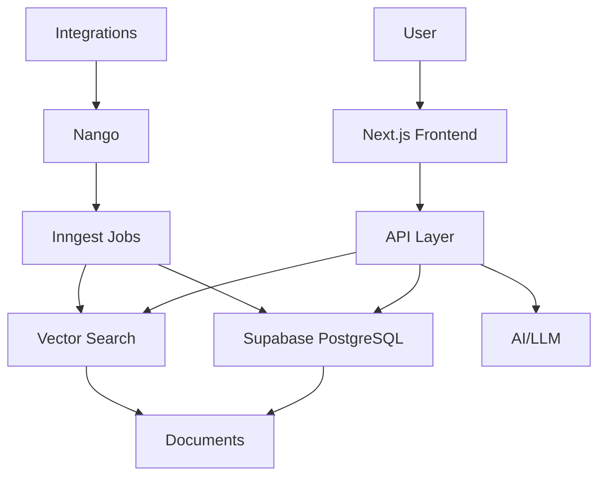
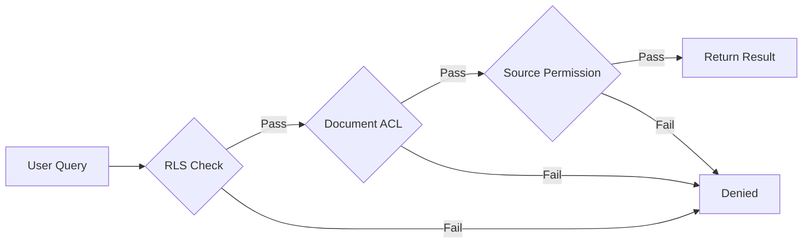

## System Architecture

Sorcia is built on a modern, scalable stack designed for enterprise-grade knowledge management.



## Core Components

### 1. Frontend (Next.js)

- **Framework**: Next.js 16 with App Router
- **UI**: React 19 + Tailwind CSS + shadcn/ui
- **State**: React Query for server state
- **Auth**: Supabase Auth with JWT

### 2. Backend (API Routes)

- **Runtime**: Next.js serverless functions
- **Authentication**: JWT-based with Supabase
- **Rate Limiting**: Per-user and per-organization
- **Caching**: Redis for query results

### 3. Database (Supabase/PostgreSQL)

- **Primary DB**: PostgreSQL 14+
- **Vector Extension**: pgvector for embeddings
- **Row-Level Security**: Organization isolation
- **Real-time**: Supabase Realtime for live updates

### 4. AI Layer

- **Embeddings**: OpenAI text-embedding-3-small (1536 dimensions)
- **LLM**: GPT-4 Turbo for answer generation
- **Fallback**: Claude 3.5 Sonnet (configurable)
- **Provider**: Vercel AI SDK (provider-agnostic)

### 5. Integration Platform (Nango)

- **OAuth Flows**: Centralized authentication
- **API Connections**: Unified interface to 100+ apps
- **Webhook Handling**: Real-time sync triggers
- **Credential Management**: Encrypted storage

### 6. Background Jobs (Inngest)

- **Document Sync**: Scheduled and event-driven
- **Embedding Generation**: Async processing
- **Webhook Processing**: Reliable delivery
- **Retry Logic**: Exponential backoff

## Data Flow

### Document Ingestion

<Steps>
  <Step title="Connection">
    User connects an integration (e.g., Slack) via OAuth
  </Step>
  
  <Step title="Initial Sync">
    Inngest job fetches all accessible documents from the integration
  </Step>
  
  <Step title="Processing">
    Documents are:
    - Chunked into smaller segments (500 tokens)
    - Cleaned and normalized
    - Metadata extracted
  </Step>
  
  <Step title="Embedding">
    Each chunk is converted to a 1536-dimension vector using OpenAI embeddings
  </Step>
  
  <Step title="Storage">
    Documents and embeddings stored in PostgreSQL with ACLs
  </Step>
  
  <Step title="Indexing">
    pgvector index created for fast similarity search
  </Step>
</Steps>

### Query Processing

<Steps>
  <Step title="User Query">
    User asks a question via web, Slack, or API
  </Step>
  
  <Step title="Query Embedding">
    Question is converted to a vector embedding
  </Step>
  
  <Step title="Hybrid Search">
    Three parallel searches:
    - Vector similarity (semantic)
    - Full-text search (keywords)
    - Metadata filtering
  </Step>
  
  <Step title="Permission Filtering">
    Results filtered based on user's ACLs
  </Step>
  
  <Step title="Ranking">
    Results ranked by relevance score
  </Step>
  
  <Step title="Context Building">
    Top N documents assembled into context
  </Step>
  
  <Step title="Answer Generation">
    LLM generates answer with context and citations
  </Step>
  
  <Step title="Response">
    Answer, citations, and metadata returned to user
  </Step>
</Steps>

## Search Technology

### Hybrid Search

Sorcia combines three search methods:

#### 1. Vector Similarity Search

```sql
-- Semantic search using cosine similarity
SELECT id, title, content,
       1 - (embedding <=> query_embedding) as similarity
FROM documents
WHERE organization_id = $1
ORDER BY embedding <=> query_embedding
LIMIT 8;
```

**Strengths**:
- Understanding context and meaning
- Finding synonyms and related concepts
- Language-agnostic

**Use Case**: "vacation policy" matches "PTO" and "time off"

#### 2. Full-Text Search

```sql
-- Keyword search using PostgreSQL's tsvector
SELECT id, title, content,
       ts_rank(search_vector, query) as rank
FROM documents
WHERE search_vector @@ to_tsquery($1)
ORDER BY rank DESC
LIMIT 8;
```

**Strengths**:
- Exact term matching
- Technical jargon and codes
- Named entities

**Use Case**: "JIRA-1234" finds that specific ticket

#### 3. Metadata Filtering

```sql
-- Filter by source, date, author, etc.
SELECT * FROM documents
WHERE source = 'notion'
  AND updated_at > '2024-01-01'
  AND metadata->>'author' = 'john@company.com';
```

**Strengths**:
- Precise filtering
- Time-based queries
- Source-specific searches

**Use Case**: "sales metrics from Q4 in Google Sheets"

### Ranking Algorithm

Results are scored using:

```typescript
final_score = (
  0.6 * vector_similarity +
  0.3 * text_relevance +
  0.1 * recency_boost
) * permission_factor
```

- **Vector similarity**: 0-1 (cosine similarity)
- **Text relevance**: ts_rank score
- **Recency boost**: Newer documents score higher
- **Permission factor**: 1.0 if full access, 0.5 if restricted

## Permission System

### Multi-Layer Security



#### Layer 1: Row-Level Security (RLS)

Database-level isolation:

```sql
-- Users can only query their organization's data
CREATE POLICY org_isolation ON documents
FOR SELECT USING (
  organization_id = current_setting('app.current_org_id')::uuid
);
```

#### Layer 2: Access Control Lists (ACLs)

Document-level permissions:

```sql
-- Check if user has access to specific document
SELECT d.* FROM documents d
JOIN acls a ON a.document_id = d.id
WHERE a.principal_id = $user_id
   OR a.principal_id IN ($user_groups);
```

#### Layer 3: Source Permissions

Mirrors original system permissions:

- **Slack**: Public channel? Is user a member?
- **Google Drive**: Does user have view access?
- **Notion**: Is page shared with user?

### Permission Sync

Permissions are synced:

- **Real-time**: Via webhooks when permissions change
- **Scheduled**: Daily full reconciliation
- **On-demand**: When access denied error occurs

## Embedding Strategy

### Document Chunking

Large documents are split into chunks:

```typescript
interface Chunk {
  content: string;      // ~500 tokens
  metadata: {
    parent_id: string;  // Original document
    position: number;   // Chunk index
    title: string;      // Context header
  };
}
```

**Why chunk?**
- Embedding models have token limits (8,191 for text-embedding-3-small)
- Smaller chunks = more precise matching
- Better citation granularity

### Embedding Model

**Current**: `text-embedding-3-small`
- **Dimensions**: 1536
- **Cost**: $0.02 / 1M tokens
- **Performance**: ~62% on MTEB benchmark

**Future**: Support for custom embeddings

### Vector Index

Uses IVFFlat algorithm:

```sql
CREATE INDEX ON documents 
USING ivfflat (embedding vector_cosine_ops) 
WITH (lists = 100);
```

- **lists**: Number of clusters (100 for less than 1M documents)
- **Distance**: Cosine similarity
- **Recall**: ~95% at 100 lists

## Scalability

### Performance Targets

| Metric | Target | Current |
|--------|--------|---------|
| Query latency | Under 2s p95 | 1.2s p95 |
| Sync latency | Under 5min | 2-3min |
| Concurrent users | 1,000+ | Tested to 2,000 |
| Documents | 10M+ | Tested to 5M |

### Optimization Strategies

<AccordionGroup>
  <Accordion title="Caching">
    - Query results cached for 5-10 minutes
    - Embeddings cached permanently
    - API responses cached at CDN
    - Invalidation on document updates
  </Accordion>
  
  <Accordion title="Indexing">
    - IVFFlat for approximate search (95% recall, 10x faster)
    - Partial indexes on frequently filtered columns
    - Composite indexes for common query patterns
  </Accordion>
  
  <Accordion title="Batching">
    - Batch embed 100 chunks at once
    - Batch database inserts
    - Deduplicate concurrent requests
  </Accordion>
  
  <Accordion title="Load Balancing">
    - Serverless functions auto-scale
    - Read replicas for queries
    - Separate pools for sync vs query
  </Accordion>
</AccordionGroup>

## Data Privacy

### Encryption

- **At rest**: AES-256 (Supabase default)
- **In transit**: TLS 1.3
- **Embeddings**: Encrypted in database
- **API keys**: Hashed with bcrypt

### Data Retention

- **Documents**: Synced from source (user controls retention)
- **Query logs**: 90 days (configurable)
- **Audit logs**: 1 year
- **Embeddings**: Until document deleted

### Compliance

- **GDPR**: Data export, right to erasure
- **SOC 2**: Type II certified
- **HIPAA**: BAA available (Enterprise)
- **ISO 27001**: Information security

## Technology Stack

### Frontend

```json
{
  "framework": "Next.js 16",
  "ui": "React 19 + Tailwind CSS 4",
  "components": "shadcn/ui + Radix UI",
  "state": "React Query + Zustand",
  "forms": "React Hook Form + Zod"
}
```

### Backend

```json
{
  "runtime": "Node.js 20",
  "api": "Next.js API Routes",
  "jobs": "Inngest",
  "integrations": "Nango",
  "payments": "Stripe"
}
```

### Database

```json
{
  "primary": "PostgreSQL 14 (Supabase)",
  "vector": "pgvector 0.5.0",
  "cache": "Redis 7",
  "search": "pg_trgm + tsvector"
}
```

### AI

```json
{
  "embeddings": "text-embedding-3-small",
  "llm": "GPT-4 Turbo",
  "sdk": "Vercel AI SDK 3.0",
  "fallback": "Claude 3.5 Sonnet"
}
```

## Next Steps

<CardGroup cols={2}>
  <Card title="Organizations" icon="building" href="/core-concepts/organizations">
    Learn about multi-tenancy
  </Card>
  <Card title="Permissions" icon="shield" href="/core-concepts/permissions">
    Understand access control
  </Card>
</CardGroup>
