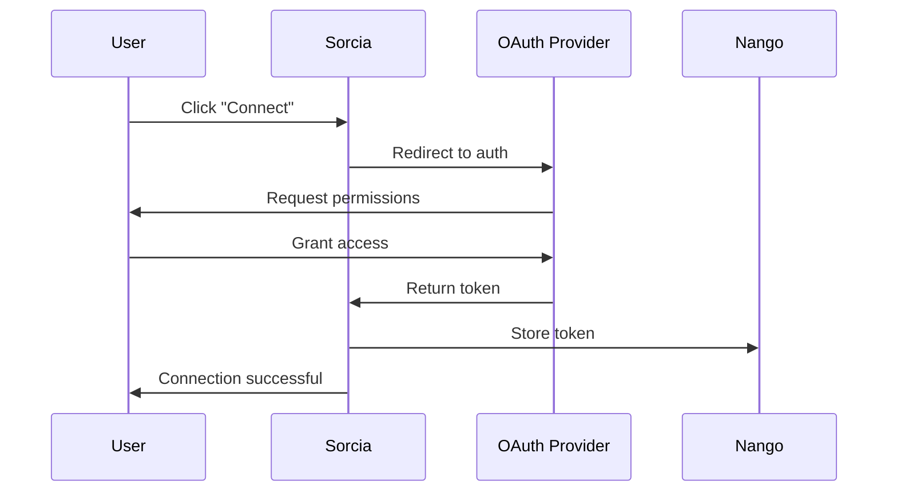

## How Integrations Work

Sorcia uses **OAuth 2.0** to securely connect to your existing tools without storing passwords.

<Steps>
  <Step title="OAuth Authorization">
    You grant Sorcia read-only access to your tool
  </Step>
  <Step title="Credential Storage">
    OAuth tokens encrypted and stored via Nango
  </Step>
  <Step title="Initial Sync">
    Sorcia fetches all accessible documents
  </Step>
  <Step title="Real-Time Updates">
    Webhooks keep data synchronized
  </Step>
</Steps>

## Supported Integrations

<CardGroup cols={3}>
  <Card title="Slack" icon="slack">
    Conversations, threads, files
  </Card>
  <Card title="Notion" icon="file-text">
    Pages, databases, wikis
  </Card>
  <Card title="Google Drive" icon="google">
    Docs, sheets, slides, PDFs
  </Card>
  <Card title="GitHub" icon="github">
    Repos, issues, PRs, docs
  </Card>
  <Card title="Confluence" icon="book-open">
    Spaces, pages, attachments
  </Card>
  <Card title="Google Chat" icon="message-square">
    Spaces, messages
  </Card>
</CardGroup>

## Connection Flow



## Permissions

Each integration requests specific permissions:

### Slack
- `channels:read` - View channel list
- `channels:history` - Read messages
- `files:read` - Access shared files
- `users:read` - User directory

### Google Drive
- `drive.readonly` - Read-only access to files
- `drive.metadata.readonly` - File metadata

### Notion
- `read_content` - Read pages and databases

<Warning>
  Sorcia never requests write permissions. All integrations are read-only.
</Warning>

## Sync Behavior

### Initial Sync

When you first connect an integration:

| Integration | Sync Time | Documents |
|-------------|-----------|-----------|
| Slack | 2-5 min | 1,000s messages |
| Notion | 5-10 min | 100s pages |
| Google Drive | 10-30 min | 1,000s files |

### Incremental Sync

After initial sync:
- **Webhooks**: Real-time (< 1 minute)
- **Polling**: Every 15 minutes (fallback)
- **Daily**: Full reconciliation at 2 AM

## Managing Integrations

Access via **Integrations** page:

### View Status

```
✓ Google Drive: 847 documents synced
⏳ Slack: Syncing... (2,453 messages)
❌ Notion: Connection expired
```

### Actions

- **Reconnect** - Refresh OAuth token
- **Configure** - Adjust sync settings
- **Pause** - Temporarily stop syncing
- **Disconnect** - Remove integration

## Data Retention

When you disconnect an integration:

<Tabs>
  <Tab title="Keep Data">
    Documents remain searchable
    
    **Use when**: Preserving historical data
  </Tab>
  <Tab title="Delete Data">
    All documents removed immediately
    
    **Use when**: Removing access completely
  </Tab>
</Tabs>

## Next Steps

<CardGroup cols={2}>
  <Card title="Connect Slack" icon="slack" href="/integrations/slack">
    Set up Slack integration
  </Card>
  <Card title="Connect Notion" icon="file-text" href="/integrations/notion">
    Set up Notion integration
  </Card>
</CardGroup>
