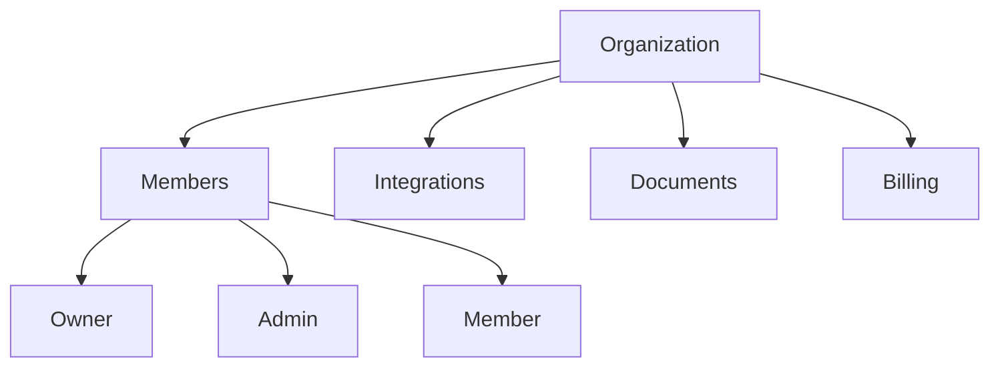

## Overview

Sorcia is built as a **multi-tenant platform** where each organization has isolated data, integrations, and team members. This ensures complete data separation and security.

## Organization Structure



## Creating an Organization

Every user who signs up creates their first organization:

<Steps>
  <Step title="Sign Up">
    Create account at sorcia.ai/signup
  </Step>
  <Step title="Name Organization">
    Choose a unique organization name
  </Step>
  <Step title="Automatic Setup">
    - Organization created
    - You become the Owner
    - Free tier activated
  </Step>
</Steps>

## Organization Settings

Access via **Settings** → **Organization**:

### General Settings

<ParamField body="name" type="string">
  Organization display name (editable by Owners/Admins)
</ParamField>

<ParamField body="slug" type="string">
  URL-safe identifier (auto-generated, immutable)
</ParamField>

<ParamField body="billing_tier" type="string">
  Current plan: free, pro, or enterprise
</ParamField>

### Data Isolation

Each organization has:
- **Separate database** - Row-level security (RLS)
- **Own integrations** - OAuth tokens per org
- **Isolated documents** - Can't access other org's data
- **Independent billing** - Separate Stripe customer

<Check>
  Organizations are completely isolated. No data sharing between orgs.
</Check>

## User Roles

### Owner

- **Full control** over organization
- Manage billing and subscription
- Delete organization
- Assign/remove all roles
- **Limit**: 1-3 per organization

### Admin

- Manage integrations
- Invite/remove members
- Configure settings
- View analytics
- **Cannot**: Delete org, manage billing

### Member

- Ask questions
- View accessible documents
- See own query history
- **Cannot**: Manage team, integrations

## Switching Organizations

Users can belong to multiple organizations:

1. Click your avatar (top-right)
2. Select **Switch Organization**
3. Choose from your organizations

<Tip>
  Keyboard shortcut: `Cmd/Ctrl + K` → Type organization name
</Tip>

## Organization Limits

| Plan | Members | Integrations | Questions/Month |
|------|---------|--------------|-----------------|
| Free | 1 | 1 | 100 |
| Pro | 10 | Unlimited | 1,000 |
| Enterprise | Unlimited | Unlimited | Unlimited |

## API Access

Each organization has:
- Unique `organization_id`
- Separate API keys
- Isolated rate limits
- Independent quotas

```javascript
// API requests are organization-scoped
const response = await fetch('https://api.sorcia.ai/api/ai/query', {
  headers: {
    'Authorization': `Bearer ${token}`, // Token contains org_id
  }
});
```

## Best Practices

<AccordionGroup>
  <Accordion title="One Org Per Company">
    Create one organization per company/team, not per department
  </Accordion>
  <Accordion title="Use Permission Groups">
    Control access via permission groups, not separate orgs
  </Accordion>
  <Accordion title="Regular Audits">
    Review members and permissions quarterly
  </Accordion>
</AccordionGroup>

## Next Steps

<CardGroup cols={2}>
  <Card title="Invite Team" icon="users" href="/team/inviting-members">
    Add team members
  </Card>
  <Card title="Permissions" icon="shield" href="/core-concepts/permissions">
    Configure access control
  </Card>
</CardGroup>
