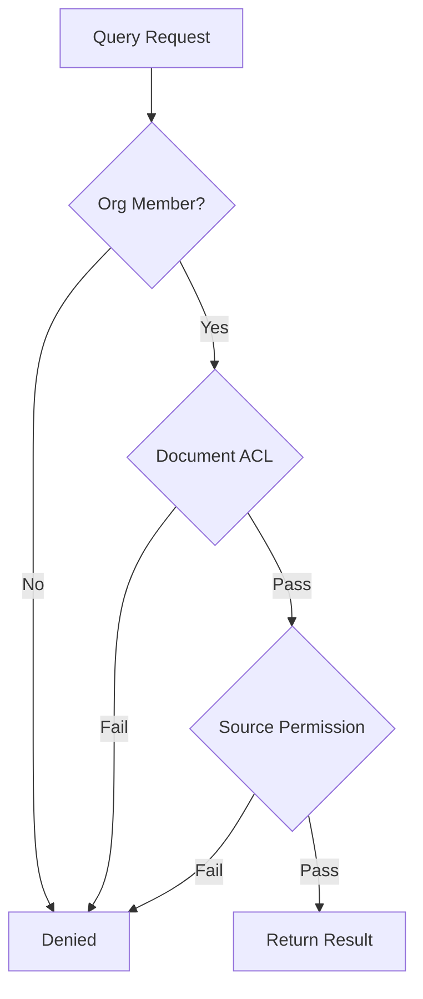
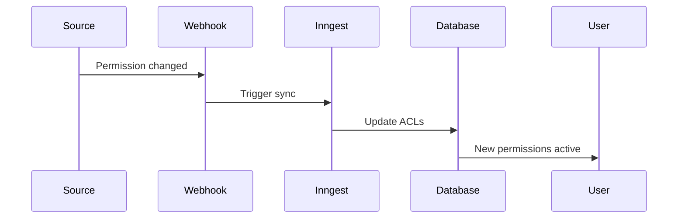

## Permission Model

Sorcia uses **multi-layered security** to ensure users only see documents they're authorized to access.

## Permission Layers



### Layer 1: Organization Membership

**Database-level isolation** using Row-Level Security (RLS):

```sql
-- Policy ensures users only access their org's data
CREATE POLICY org_isolation ON documents
FOR SELECT USING (
  organization_id = current_user_org_id()
);
```

### Layer 2: Access Control Lists (ACLs)

**Document-level permissions**:

```typescript
interface ACL {
  document_id: string;
  principal_type: 'user' | 'group' | 'channel';
  principal_id: string;
}
```

**Example**:
```
Document: "Sales Strategy 2024"
ACLs:
  - user:john@company.com
  - group:sales-team
  - channel:C123ABC (Slack)
```

### Layer 3: Source Permissions

**Mirrors original system permissions**:

<Tabs>
  <Tab title="Slack">
    - Public channel → All workspace members
    - Private channel → Only channel members
    - DMs → Never indexed
  </Tab>
  <Tab title="Google Drive">
    - File permissions synced
    - Folder inheritance respected
    - Shared drives supported
  </Tab>
  <Tab title="Notion">
    - Page permissions mirrored
    - Workspace access respected
    - Guest access honored
  </Tab>
</Tabs>

## User Roles

### Organization Roles

| Role | Permissions |
|------|-------------|
| **Owner** | Full admin access, billing, delete org |
| **Admin** | Manage integrations, invite users, configure |
| **Member** | Query knowledge base, view own history |

### Custom Permission Groups

Create groups for fine-grained control:

```yaml
Sales Team:
  members:
    - john@company.com
    - sarah@company.com
  integrations:
    google-drive: /Sales/*
    slack: #sales, #sales-emea
    notion: Sales Playbook
  permissions:
    query: true
    export: false
    analytics: team_only
```

## Permission Sync

### Real-Time Sync

Permissions updated when:
- User added/removed from Slack channel
- Google Drive file sharing changes
- Notion page permissions modified

**Sync Method**:


### Daily Reconciliation

Full permission audit runs nightly:
1. Fetch all ACLs from source systems
2. Compare with Sorcia's ACL table
3. Update differences
4. Log changes for audit

## Query-Time Filtering

Every search automatically filters by permissions:

```sql
SELECT d.*
FROM documents d
WHERE d.organization_id = $org_id
  AND (
    -- User has direct access
    EXISTS (
      SELECT 1 FROM acls
      WHERE document_id = d.id
        AND principal_id = $user_id
    )
    OR
    -- User's group has access
    EXISTS (
      SELECT 1 FROM acls
      WHERE document_id = d.id
        AND principal_id IN ($user_groups)
    )
  );
```

## Audit Logging

All queries are logged:

```typescript
interface QueryLog {
  id: string;
  user_id: string;
  organization_id: string;
  question: string;
  sources_accessed: number;
  documents_returned: string[];
  timestamp: Date;
}
```

**Retention**: 90 days (configurable)

## Best Practices

<AccordionGroup>
  <Accordion title="Use Groups, Not Individual Users">
    Manage permissions via groups (e.g., "Engineering", "Sales") rather than individual users
  </Accordion>
  
  <Accordion title="Principle of Least Privilege">
    Grant minimum necessary access. Users can always request more.
  </Accordion>
  
  <Accordion title="Regular Audits">
    Review permissions quarterly. Remove access for departed team members.
  </Accordion>
  
  <Accordion title="Monitor Access Logs">
    Check audit logs for unusual access patterns
  </Accordion>
</AccordionGroup>

## Common Scenarios

### New Employee

<Steps>
  <Step title="Invite to Sorcia">
    Admin sends invitation
  </Step>
  <Step title="Auto-Assigned Groups">
    User automatically added to department group
  </Step>
  <Step title="Inherit Permissions">
    User gets access to all group documents
  </Step>
</Steps>

### Sensitive Document

<Steps>
  <Step title="Restrict in Source">
    Limit access in Google Drive/Notion
  </Step>
  <Step title="Sync Permissions">
    Sorcia automatically mirrors restrictions
  </Step>
  <Step title="Verify">
    Test with non-privileged user account
  </Step>
</Steps>

### Department Data

```yaml
Engineering Department:
  members: [eng-team]
  sources:
    github: all repos
    slack: #engineering, #dev-ops
    notion: Engineering Wiki
  restrictions:
    exclude_slack: #sales, #hr
    exclude_drive: /Sales/*, /HR/*
```

## Troubleshooting

<AccordionGroup>
  <Accordion title="User can't see expected documents">
    **Check**:
    - User is org member
    - Source permissions are correct
    - ACLs have synced (wait 1-2 min)
    - Document isn't excluded via filters
  </Accordion>
  
  <Accordion title="Too many results returned">
    **Cause**: User has broad access
    
    **Solution**: Use filters or create restricted permission groups
  </Accordion>
  
  <Accordion title="Permissions not updating">
    **Fix**: Manual re-sync via Integrations → Configure → Sync Permissions
  </Accordion>
</AccordionGroup>

## Security Guarantees

<Check>
  ✓ **No data leakage** - Users never see unauthorized documents
  
  ✓ **Automatic sync** - Permissions update in real-time
  
  ✓ **Source-of-truth** - Respects original system permissions
  
  ✓ **Audit trail** - All access logged for compliance
</Check>

## Next Steps

<CardGroup cols={2}>
  <Card title="Team Management" icon="users" href="/team/roles-permissions">
    Configure user roles
  </Card>
  <Card title="Security Overview" icon="shield" href="/security/overview">
    Learn about security features
  </Card>
</CardGroup>
