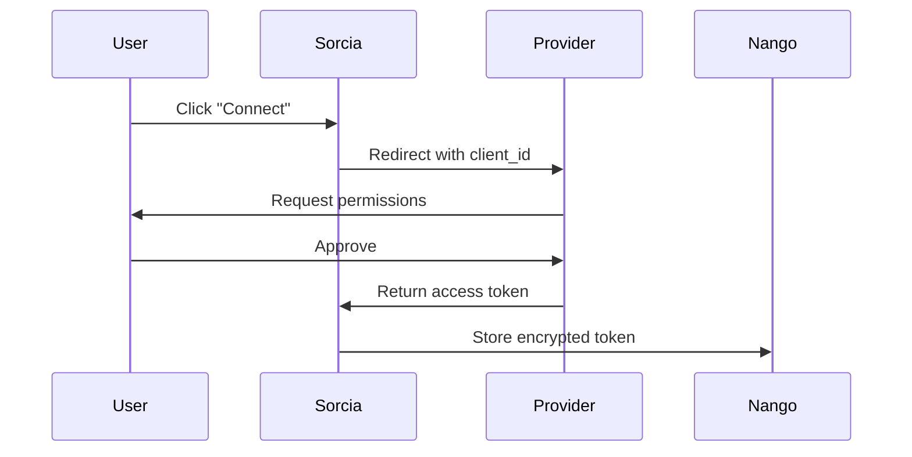

## Available Integrations

Connect Sorcia to your existing tools in minutes. All integrations are read-only and respect your existing permissions.

<CardGroup cols={3}>
  <Card title="Slack" icon="slack" href="/integrations/slack">
    Conversations, threads, files
  </Card>
  <Card title="Notion" icon="file-text" href="/integrations/notion">
    Pages, databases, wikis
  </Card>
  <Card title="Google Drive" icon="google" href="/integrations/google-drive">
    Docs, sheets, slides, PDFs
  </Card>
  <Card title="GitHub" icon="github" href="/integrations/github">
    Repos, issues, PRs, docs
  </Card>
  <Card title="Confluence" icon="book-open" href="/integrations/confluence">
    Spaces, pages, attachments
  </Card>
  <Card title="Custom" icon="code" href="/integrations/custom">
    Build your own integration
  </Card>
</CardGroup>

## How Integrations Work

<Steps>
  <Step title="OAuth Connection">
    Securely authorize Sorcia with one click
  </Step>
  <Step title="Initial Sync">
    We fetch all documents you have access to
  </Step>
  <Step title="Indexing">
    Documents are processed and embedded
  </Step>
  <Step title="Real-Time Updates">
    Webhooks keep everything in sync
  </Step>
</Steps>

## Quick Comparison

| Integration | Setup Time | Sync Speed | Real-Time | Best For |
|-------------|------------|------------|-----------|----------|
| **Slack** | 2 min | Fast | ✓ | Team conversations |
| **Notion** | 3 min | Medium | ✓ | Documentation |
| **Google Drive** | 3 min | Medium | ✓ | Files & docs |
| **GitHub** | 4 min | Fast | ✓ | Code & issues |
| **Confluence** | 3 min | Medium | ✓ | Wikis |

## Connection Methods

### OAuth 2.0 (Recommended)

Most integrations use OAuth for secure, password-less authentication:



**Benefits**:
- No password sharing
- Granular permissions
- Easy revocation
- Automatic token refresh

### API Keys

Some integrations support API keys:
- Manual configuration
- Full access (less secure)
- No expiration
- Use for testing only

<Warning>
  Always prefer OAuth over API keys for production use.
</Warning>

## What Gets Synced

### Document Types

<Tabs>
  <Tab title="Slack">
    - Public channel messages
    - Private channel messages (if invited)
    - Thread replies
    - Shared files
    - User profiles
  </Tab>
  <Tab title="Notion">
    - Pages
    - Databases
    - Inline content
    - Attached files
    - Comments
  </Tab>
  <Tab title="Google Drive">
    - Google Docs
    - Google Sheets
    - Google Slides
    - PDFs
    - Text files
  </Tab>
  <Tab title="GitHub">
    - README files
    - Markdown docs
    - Issues
    - Pull requests
    - Wiki pages
  </Tab>
</Tabs>

### What's Excluded

- Deleted/archived items
- Draft content
- Private messages (Slack DMs)
- Files you don't have access to
- Binary files (images, videos)

## Sync Behavior

### Initial Sync

First-time connection:
- Fetches all accessible documents
- Processes in batches of 100
- Takes 5-30 minutes depending on size
- Can query as soon as first docs indexed

### Incremental Sync

After initial sync:
- **Webhooks**: Updates within 60 seconds
- **Polling**: Every 15 minutes (fallback)
- **Daily**: Full reconciliation

### Manual Sync

Force immediate sync:
1. Go to **Integrations**
2. Click integration card
3. Click **Sync Now**

## Managing Integrations

### Integration Dashboard

View all connections at **Integrations** page:

```
✓ Slack: 2,453 messages synced · Last: 2 min ago
✓ Google Drive: 847 files synced · Last: 5 min ago
⏳ Notion: Syncing 89 pages...
❌ GitHub: Connection expired
```

### Actions

<CardGroup cols={2}>
  <Card title="Configure" icon="gear">
    Adjust sync settings, filters
  </Card>
  <Card title="Reconnect" icon="refresh">
    Refresh OAuth token
  </Card>
  <Card title="Pause" icon="pause">
    Stop syncing temporarily
  </Card>
  <Card title="Disconnect" icon="x">
    Remove integration
  </Card>
</CardGroup>

## Filtering Content

### Source Filters

Limit what gets synced:

<Tabs>
  <Tab title="Slack">
    ```yaml
    include_channels:
      - #engineering
      - #product
    exclude_channels:
      - #random
      - #social
    ```
  </Tab>
  <Tab title="Google Drive">
    ```yaml
    include_folders:
      - /Company/Documents
      - /Shared Drives/Product
    exclude_patterns:
      - "*/Archive/*"
      - "*/Drafts/*"
    ```
  </Tab>
  <Tab title="Notion">
    ```yaml
    include_workspaces:
      - Engineering Wiki
      - Product Docs
    exclude_databases:
      - Personal Notes
    ```
  </Tab>
</Tabs>

## Troubleshooting

<AccordionGroup>
  <Accordion title="Integration not syncing">
    1. Check connection status
    2. Verify OAuth token hasn't expired
    3. Check for permission changes
    4. Try manual sync
    5. Reconnect if needed
  </Accordion>
  
  <Accordion title="Missing documents">
    - Verify you have access in source system
    - Check integration filters
    - Wait for sync to complete
    - Review sync logs for errors
  </Accordion>
  
  <Accordion title="Slow sync speed">
    - Normal for large workspaces (10K+ docs)
    - Sync runs in background
    - Can query available docs immediately
    - Upgrade plan for faster processing
  </Accordion>
</AccordionGroup>

## Rate Limits

API rate limits by plan:

| Plan | Sync Rate | API Calls/Min |
|------|-----------|---------------|
| Free | 10 docs/min | 60 |
| Pro | 100 docs/min | 600 |
| Enterprise | 1000 docs/min | 6000 |

## Security

<Check>
  ✓ **Read-only access** - We never modify your data
  
  ✓ **Encrypted tokens** - OAuth tokens encrypted at rest
  
  ✓ **Permission-aware** - Respects your access controls
  
  ✓ **Audit logs** - All syncs logged for compliance
</Check>

## Next Steps

<CardGroup cols={2}>
  <Card title="Connect Slack" icon="slack" href="/integrations/slack">
    Team conversations
  </Card>
  <Card title="Connect Notion" icon="file-text" href="/integrations/notion">
    Documentation
  </Card>
  <Card title="Connect Google Drive" icon="google" href="/integrations/google-drive">
    Files and docs
  </Card>
  <Card title="Build Custom" icon="code" href="/integrations/custom">
    Custom integration
  </Card>
</CardGroup>
