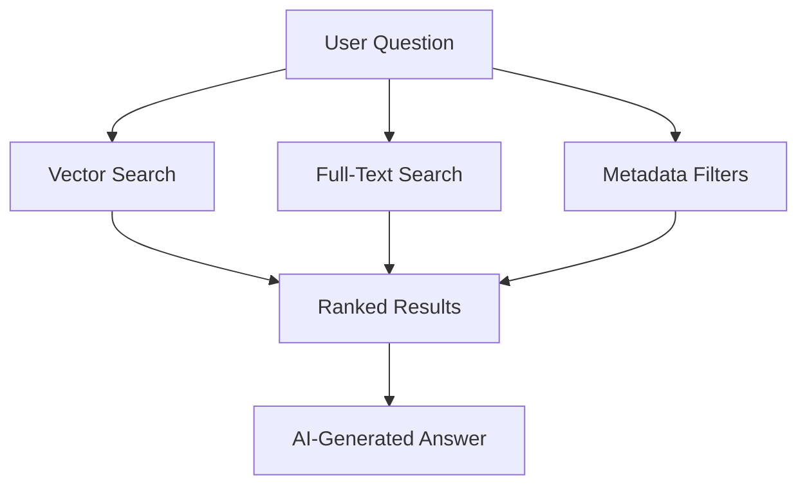

## Overview

Sorcia combines enterprise-grade security, AI-powered search, and seamless integrations to create the ultimate knowledge management platform. Here's what sets us apart.

## 🔗 Universal Integrations

Connect all your tools in one place without migration or data duplication.

<CardGroup cols={2}>
  <Card title="Slack" icon="slack">
    Sync conversations, threads, and files from your Slack workspace
  </Card>
  <Card title="Notion" icon="file-text">
    Index pages, databases, and wikis from Notion
  </Card>
  <Card title="Google Drive" icon="google">
    Search across docs, sheets, slides, and PDFs
  </Card>
  <Card title="GitHub" icon="github">
    Access code, issues, PRs, and documentation
  </Card>
  <Card title="Confluence" icon="book-open">
    Index spaces, pages, and attachments
  </Card>
  <Card title="Custom" icon="puzzle">
    Build custom integrations with our API
  </Card>
</CardGroup>

### How It Works

1. **OAuth Connection** - Secure, one-click authorization
2. **Permission Sync** - We respect your existing access controls
3. **Real-Time Updates** - Changes sync automatically via webhooks
4. **Background Processing** - Documents index without slowing you down

<Tip>
  New integrations are added regularly. [Request an integration](https://sorcia.ai/integrations/request) if you don't see yours.
</Tip>

## 🤖 AI-Powered Search

Go beyond keyword matching with intelligent, context-aware search.

### Hybrid Search Engine

Sorcia combines three search methods for superior accuracy:



<Accordion title="Vector Search (Semantic)">
  Uses AI embeddings to understand meaning and context. Finds documents even when they use different words.
  
  **Example**: Searching "PTO" finds documents about "vacation policy" and "time off"
</Accordion>

<Accordion title="Full-Text Search (Keyword)">
  Traditional search for exact matches and technical terms. Perfect for finding specific names, codes, or IDs.
  
  **Example**: Searching "JIRA-1234" finds that exact ticket
</Accordion>

<Accordion title="Metadata Filters">
  Narrow results by source, date, author, or custom properties.
  
  **Example**: "sales metrics from last quarter in Google Sheets"
</Accordion>

### Answer Quality

Every answer includes:

- **Source Citations** - See exactly where information came from
- **Confidence Score** - Know how certain the AI is about the answer
- **Related Questions** - Discover connected information
- **Follow-up Suggestions** - Dig deeper with one click

<CodeGroup>

```bash User Question
How do we handle customer refunds?
```

```markdown Sorcia Response
Based on your Customer Support Handbook (Notion) and #support-team 
conversations (Slack):

**Standard Refund Process:**
1. Verify purchase within refund window (30 days)
2. Confirm customer identity via email
3. Process refund through Stripe dashboard
4. Update ticket status to "Refunded"

**Special Cases:**
- Enterprise customers: Requires manager approval
- Amounts over $1,000: Finance team review needed
- Outside refund window: Escalate to support lead

**Sources:**
- Customer Support Handbook v3.2 (Notion)
- #support-team discussion on 2024-10-15 (Slack)
- Finance Policy Q4 2024 (Google Drive)

Confidence: 95%
```

</CodeGroup>

## 🔒 Enterprise Security

Security isn't an afterthought—it's built into every layer of Sorcia.

### Permission-Aware Retrieval

<Steps>
  <Step title="Permission Sync">
    When you connect an integration, Sorcia syncs all access control lists (ACLs)
  </Step>
  <Step title="Query Filtering">
    Every search automatically filters results based on your permissions
  </Step>
  <Step title="Real-Time Updates">
    When permissions change in the source system, Sorcia updates immediately
  </Step>
</Steps>

<Check>
  **Result**: Users only see documents they're authorized to access, just like in the original system.
</Check>

### Security Features

<CardGroup cols={2}>
  <Card title="Row-Level Security" icon="database">
    Organization-scoped data isolation at the database level
  </Card>
  <Card title="Audit Logs" icon="clipboard-list">
    Every query is logged with user, timestamp, and sources accessed
  </Card>
  <Card title="SOC 2 Compliance" icon="shield-check">
    Architecture aligned with SOC 2 Type II requirements
  </Card>
  <Card title="Encryption" icon="lock">
    Data encrypted at rest and in transit (TLS 1.3)
  </Card>
</CardGroup>

### Compliance

- **GDPR** - Data export and deletion on request
- **CCPA** - California privacy rights supported
- **HIPAA** - Enterprise plans include BAA
- **ISO 27001** - Information security management

## ⚡ Real-Time Sync

Stay up-to-date without manual refreshes.

### How Sync Works

1. **Initial Index** - Full sync when you first connect an integration
2. **Webhooks** - Real-time updates when documents change
3. **Scheduled Refresh** - Daily checks for changes in sources without webhooks
4. **On-Demand Sync** - Manual re-sync anytime from the dashboard

<Info>
  **Sync Status**: Monitor sync progress in real-time from the Integrations page
</Info>

### Sync Performance

| Workspace Size | Initial Sync | Incremental Updates |
|----------------|--------------|---------------------|
| Small (< 1K docs) | 2-5 minutes | < 30 seconds |
| Medium (1K-10K) | 10-30 minutes | < 2 minutes |
| Large (> 10K) | 1-2 hours | < 5 minutes |

## 💬 Slack Native Integration

Use Sorcia without leaving Slack.

### `/sorcia` Command

Ask questions directly in Slack:

```bash
/sorcia What's the API rate limit for our pro plan?
```

Sorcia responds with:

<Check>
  ✓ **Answer with citations**  
  ✓ **Ephemeral message** (only you see it)  
  ✓ **Follow-up buttons** for more details  
  ✓ **Share publicly** option
</Check>

### Slack App Features

- **Slash Commands** - `/sorcia [question]`
- **Mentions** - `@Sorcia how do I...`
- **Direct Messages** - DM the Sorcia bot
- **Channel Summaries** - Get channel overviews
- **Thread Context** - Ask about specific threads

<Tip>
  Install the Slack app during integration setup. [Learn more →](/integrations/slack)
</Tip>

## 📊 Analytics Dashboard

Understand how your team uses knowledge.

### Key Metrics

<CardGroup cols={3}>
  <Card title="Total Questions" icon="message-question">
    Track usage trends over time
  </Card>
  <Card title="Active Users" icon="users">
    See who's using Sorcia
  </Card>
  <Card title="Top Topics" icon="chart-bar">
    Discover what people ask about
  </Card>
  <Card title="Response Time" icon="clock">
    Monitor performance
  </Card>
  <Card title="Source Coverage" icon="database">
    See which tools are most valuable
  </Card>
  <Card title="Confidence Scores" icon="star">
    Track answer quality
  </Card>
</CardGroup>

### Insights

- **Knowledge Gaps** - Identify questions without good answers
- **Popular Questions** - See what your team asks most
- **User Activity** - Track engagement and adoption
- **Source Analytics** - Which integrations drive the most value

## 👥 Team Management

Collaborate securely with granular access controls.

### Roles & Permissions

<Tabs>
  <Tab title="Owner">
    - Full administrative access
    - Billing management
    - Delete organization
    - Manage all members
  </Tab>
  <Tab title="Admin">
    - Add/remove integrations
    - Invite members
    - Configure permissions
    - View analytics
  </Tab>
  <Tab title="Member">
    - Ask questions
    - View own history
    - Access permitted documents
  </Tab>
</Tabs>

### Permission Groups

Create custom permission groups for fine-grained control:

```yaml Example: Sales Team
integrations:
  - google-drive: /Sales/*
  - slack: #sales, #sales-emea
  - notion: Sales Playbook
permissions:
  - query: true
  - export: false
  - analytics: team_only
```

<Card title="Learn More" icon="shield" href="/team/access-control">
  Deep dive into permissions and access control
</Card>

## 🎯 What Makes Sorcia Different?

<CardGroup cols={2}>
  <Card title="No Data Migration">
    Connect to existing tools—no need to move or duplicate data
  </Card>
  <Card title="Permission-Aware">
    Automatically respects existing access controls
  </Card>
  <Card title="Multi-Tenant">
    Secure isolation for organizations sharing the platform
  </Card>
  <Card title="API-First">
    Build custom workflows with our comprehensive API
  </Card>
</CardGroup>

## Ready to Get Started?

<Card title="Try Sorcia Free" icon="rocket" href="https://sorcia.ai/signup">
  Start your free account—no credit card required
</Card>
