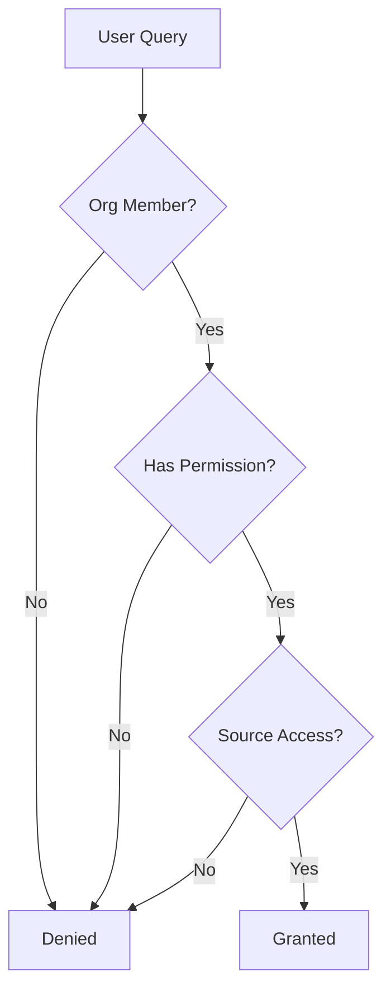

## Security Architecture

Sorcia is built with enterprise-grade security from the ground up.

## Core Security Principles

<CardGroup cols={2}>
  <Card title="Encryption" icon="lock">
    Data encrypted at rest and in transit
  </Card>
  <Card title="Isolation" icon="database">
    Multi-tenant with row-level security
  </Card>
  <Card title="Permission-Aware" icon="shield">
    Respects source system permissions
  </Card>
  <Card title="Audit Logging" icon="clipboard-list">
    Complete audit trail
  </Card>
</CardGroup>

## Data Protection

### Encryption

**At Rest:**
- AES-256 encryption (Supabase)
- Encrypted database backups
- Encrypted embeddings storage

**In Transit:**
- TLS 1.3 for all connections
- HTTPS-only API endpoints
- Encrypted webhook payloads

### Data Isolation

**Multi-Tenancy:**
- Row-Level Security (RLS) in PostgreSQL
- Organization-scoped data
- No cross-tenant data access

**Permission Model:**

## Authentication & Authorization

### Authentication

- **JWT-based** - Stateless sessions
- **OAuth 2.0** - Integration auth
- **MFA** - Multi-factor authentication (Enterprise)
- **SSO** - SAML/OIDC (Enterprise)

### Authorization

- **Role-Based** - Owner, Admin, Member
- **Permission Groups** - Custom access control
- **Source Mirroring** - Respects original permissions

## Infrastructure Security

### Hosting

- **Vercel** - Edge network with DDoS protection
- **Supabase** - SOC 2 Type II certified
- **AWS** - Enterprise-grade infrastructure

### Network Security

- **Firewall** - Application-level firewall
- **Rate Limiting** - API rate limits
- **IP Allowlisting** - Enterprise feature

## Compliance

<CardGroup cols={2}>
  <Card title="SOC 2 Type II" icon="shield-check">
    Independently audited security controls
  </Card>
  <Card title="GDPR" icon="globe">
    EU data protection compliance
  </Card>
  <Card title="CCPA" icon="scale">
    California privacy rights
  </Card>
  <Card title="HIPAA" icon="hospital">
    Healthcare data security (Enterprise)
  </Card>
</CardGroup>

## Data Privacy

### Data Collection

We collect only what's necessary:
- Query text (for processing)
- Document content (for indexing)
- Usage analytics (for improvement)

### Data Retention

- **Documents** - Synced from source, deleted with integration
- **Query logs** - 90 days (configurable)
- **Audit logs** - 1 year minimum
- **Embeddings** - Until document deleted

### Data Rights

Users can request:
- **Data export** - Full data dump
- **Data deletion** - Right to erasure
- **Access logs** - View all queries

## Security Features

### Read-Only Access

<Check>
  All integrations are read-only. Sorcia never modifies your data.
</Check>

### Permission Sync

- Real-time permission updates
- Source system as source of truth
- Automatic re-validation

### Audit Logging

Every action logged:
- User queries
- Document access
- Permission changes
- Integration events

## Incident Response

### Security Monitoring

- 24/7 automated monitoring
- Anomaly detection
- Immediate alerting

### Response Plan

1. **Detection** - Automated alerts
2. **Assessment** - Team evaluation
3. **Containment** - Isolate issue
4. **Communication** - Customer notification
5. **Resolution** - Fix and verify
6. **Post-Mortem** - Document learnings

## Best Practices

<AccordionGroup>
  <Accordion title="Use Strong Passwords">
    Minimum 12 characters, mix of types
  </Accordion>
  <Accordion title="Enable MFA">
    Multi-factor authentication for all admins
  </Accordion>
  <Accordion title="Review Access Regularly">
    Audit permissions quarterly
  </Accordion>
  <Accordion title="Monitor Audit Logs">
    Check for unusual activity
  </Accordion>
</AccordionGroup>

## Security Disclosures

Found a security issue? Email: security@sorcia.ai

We offer a bug bounty program for responsible disclosure.

## Next Steps

<CardGroup cols={2}>
  <Card title="Authentication" icon="key" href="/security/authentication">
    Learn about auth security
  </Card>
  <Card title="Audit Logs" icon="clipboard-list" href="/security/audit-logs">
    View access logs
  </Card>
  <Card title="Compliance" icon="shield-check" href="/security/compliance">
    Compliance details
  </Card>
</CardGroup>
