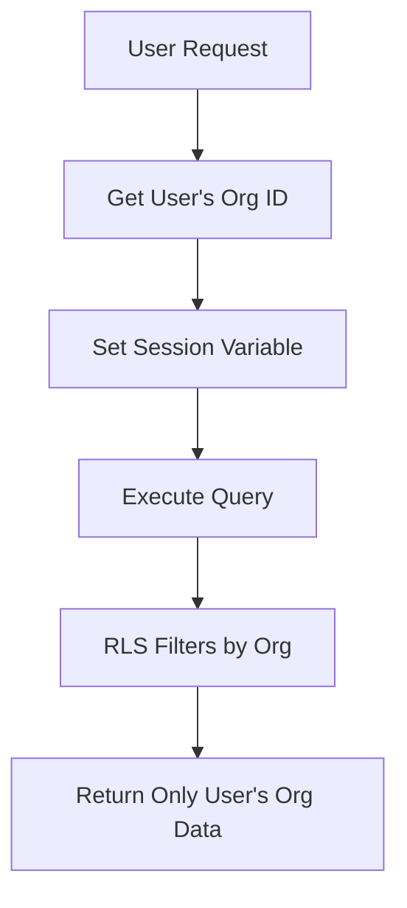

## Overview

Sorcia uses PostgreSQL's Row-Level Security (RLS) to enforce organization-level data isolation at the database layer.

## How RLS Works

Every database query automatically filters by organization:

```sql
-- Policy enforces organization isolation
CREATE POLICY org_isolation ON documents
FOR SELECT USING (
  organization_id = current_setting('app.current_org_id')::uuid
);
```

**Result:** Users can only access data from their organization, even with direct database access.

## Security Policies

### Documents Table

```sql
-- Read policy
CREATE POLICY documents_read ON documents
FOR SELECT USING (
  organization_id = get_user_org_id()
);

-- Insert policy  
CREATE POLICY documents_insert ON documents
FOR INSERT WITH CHECK (
  organization_id = get_user_org_id()
);

-- Update policy
CREATE POLICY documents_update ON documents
FOR UPDATE USING (
  organization_id = get_user_org_id()
);

-- Delete policy
CREATE POLICY documents_delete ON documents
FOR DELETE USING (
  organization_id = get_user_org_id()
);
```

### Memberships Table

```sql
CREATE POLICY membership_read ON memberships
FOR SELECT USING (
  organization_id = get_user_org_id()
  OR user_id = auth.uid()
);
```

## Benefits

<CardGroup cols={2}>
  <Card title="Defense in Depth" icon="shield">
    Security at database level
  </Card>
  <Card title="No Application Bugs" icon="bug">
    Works even if app has bugs
  </Card>
  <Card title="Audit Compliance" icon="clipboard-check">
    Database-level isolation
  </Card>
  <Card title="Performance" icon="zap">
    Database handles filtering
  </Card>
</CardGroup>

## Multi-Tenant Architecture



## Session Context

Each request sets the user's organization:

```typescript
await supabase.rpc('set_user_org', {
  org_id: user.organization_id
});

// All subsequent queries filtered by org
const { data } = await supabase
  .from('documents')
  .select('*'); // Automatically filtered
```

## Testing RLS

Verify RLS is working:

```sql
-- Try to access another org's data
SET app.current_org_id = 'other-org-id';
SELECT * FROM documents;
-- Returns empty (blocked by RLS)

-- Set back to your org
SET app.current_org_id = 'your-org-id';
SELECT * FROM documents;
-- Returns your documents
```

## Next Steps

<Card title="Audit Logs" icon="clipboard-list" href="/security/audit-logs">
  View access logs
</Card>
