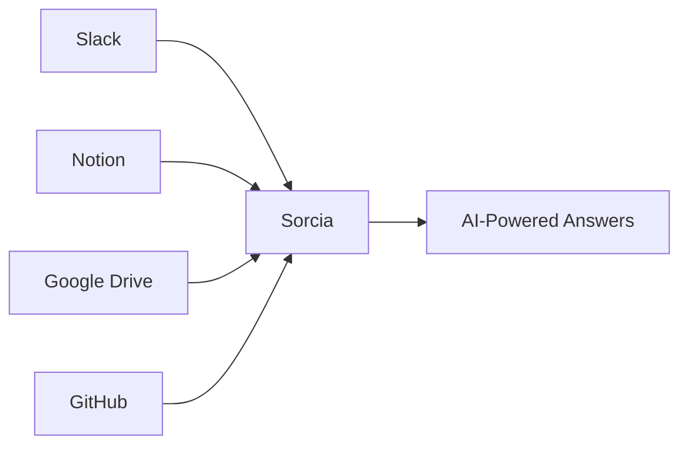

## Overview

Sorcia is an **AI-powered enterprise knowledge base** that acts as a single source of truth for all your company's information. It connects to your existing tools—like Slack, Notion, Google Drive, GitHub, and more—and uses AI to help your team find answers instantly.

<Note>
  Think of Sorcia as having a knowledgeable coworker who has read every document, message, and file in your company and can answer any question in seconds.
</Note>

## The Problem We Solve

Modern teams use dozens of tools to collaborate and store information:

- **Slack** for conversations
- **Notion** for documentation  
- **Google Drive** for files
- **GitHub** for code
- **Confluence** for wikis

This creates several challenges:

<Warning>
  **Information Silos** - Knowledge is scattered across multiple platforms  
  **Context Switching** - Teams waste hours searching different tools  
  **Onboarding Friction** - New hires struggle to find information  
  **Lost Knowledge** - Important information gets buried or forgotten
</Warning>

## How Sorcia Helps

Sorcia solves these problems by:

### 1. **Connecting Everything**

Sorcia integrates with your existing tools through secure OAuth connections. No migration required—your data stays where it is.



### 2. **Understanding Context**

Using advanced AI and embeddings, Sorcia understands the meaning and context of your questions, not just keywords.

<CodeGroup>

```bash Example Question
/sorcia How do I submit expense reports?
```

```markdown Sorcia Response
Based on your company's Expense Policy (Google Drive) and recent 
conversations in #finance (Slack):

1. Fill out the Expense Report form
2. Attach receipts
3. Submit via the Finance Portal
4. Approvals typically take 2-3 days

Sources: Expense Policy v2.4 (Google Drive), #finance conversation (Slack)
```

</CodeGroup>

### 3. **Maintaining Security**

Every answer respects your existing permissions. If you can't access a document in Google Drive, Sorcia won't show it in results.

<Check>
  **Permission-Aware** - Only shows documents you have access to  
  **Row-Level Security** - Organization-scoped data isolation  
  **Audit Logs** - Track every query for compliance  
  **SOC 2 Ready** - Enterprise-grade security architecture
</Check>

## Use Cases

### For Teams

<AccordionGroup>
  <Accordion title="Customer Support">
    Answer customer questions faster by instantly finding relevant documentation, previous tickets, and internal knowledge.
  </Accordion>
  
  <Accordion title="Engineering">
    Find code examples, architecture decisions, and deployment processes without digging through Slack history or wikis.
  </Accordion>
  
  <Accordion title="Sales">
    Access product information, pricing details, and competitive intel instantly during calls.
  </Accordion>
  
  <Accordion title="HR & Operations">
    Help employees find policies, benefits information, and onboarding materials without manual support.
  </Accordion>
</AccordionGroup>

### For Individuals

- **New Employees** - Get up to speed faster without bothering teammates
- **Managers** - Access historical context and decisions quickly
- **Executives** - Get instant answers about company metrics and initiatives

## How It Works

<Steps>
  <Step title="Connect Your Tools">
    Link Sorcia to your existing platforms through secure OAuth. Takes 2 minutes per integration.
  </Step>
  
  <Step title="Automatic Indexing">
    Sorcia automatically indexes your documents, creating AI embeddings while respecting permissions.
  </Step>
  
  <Step title="Ask Questions">
    Use the web app, Slack command (`/sorcia`), or API to ask questions in natural language.
  </Step>
  
  <Step title="Get Answers">
    Receive AI-generated answers with citations showing exactly where the information came from.
  </Step>
</Steps>

## Architecture

Sorcia is built on modern, scalable infrastructure:

- **Next.js** - Fast, server-rendered web application
- **Supabase** - PostgreSQL database with vector search (pgvector)
- **Vercel AI SDK** - Provider-agnostic AI integrations
- **Inngest** - Reliable background job processing
- **Nango** - Unified OAuth and API integrations

<Tip>
  Want to dive deeper? Check out [How Sorcia Works](/core-concepts/how-it-works) for technical details.
</Tip>

## Pricing

Sorcia offers flexible pricing for teams of all sizes:

| Plan | Price | Best For |
|------|-------|----------|
| **Free** | $0/month | Individual users and small teams testing the platform |
| **Pro** | $49/month | Growing teams needing more integrations and queries |
| **Enterprise** | Custom | Large organizations requiring advanced security and support |

<Card title="See Full Pricing" icon="credit-card" href="https://sorcia.ai/pricing">
  Compare plans and find the right fit for your team
</Card>

## Next Steps

Ready to get started?

<CardGroup cols={2}>
  <Card
    title="Quickstart Guide"
    icon="rocket"
    href="/getting-started/quickstart"
  >
    Set up Sorcia in 5 minutes
  </Card>
  <Card
    title="Try Sorcia"
    icon="arrow-right"
    href="https://sorcia.ai/signup"
  >
    Create your free account
  </Card>
</CardGroup>
